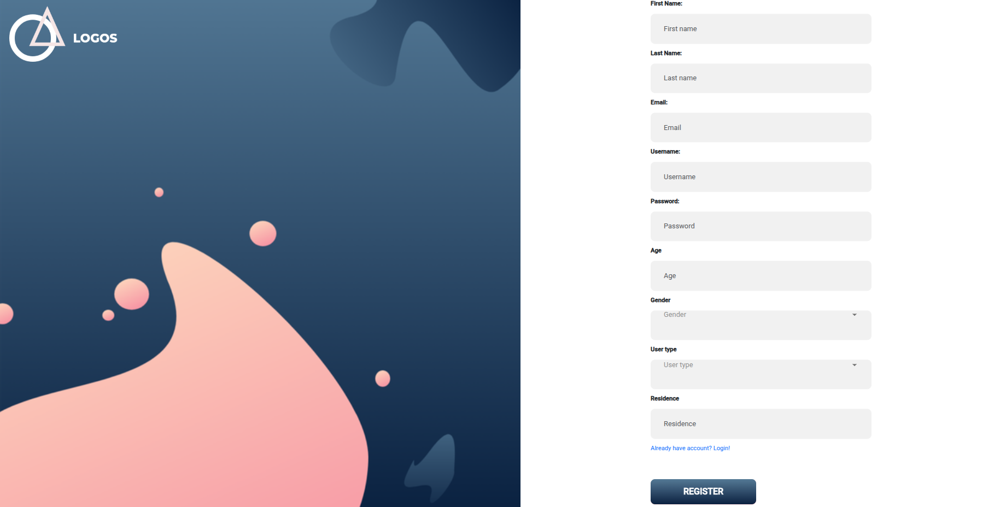
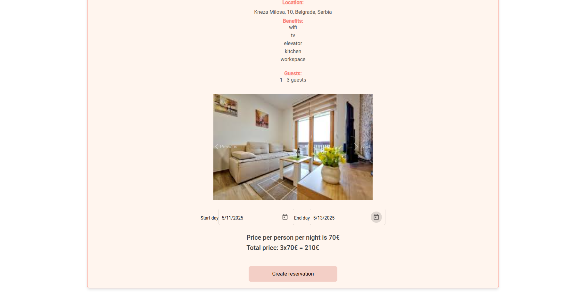
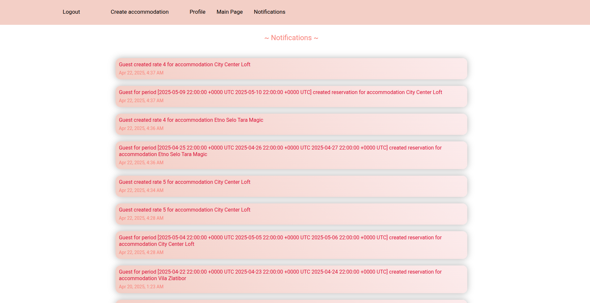

# Airbnb-Project
This Airbnb application is a comprehensive platform designed to offer a user-friendly experience for both travelers looking for short-term rentals and hosts who want to list their properties. Inspired by the functionality and design of Airbnb, the application allows users to search, book, and review unique accommodations around the world while enabling property owners to manage their listings and bookings seamlessly. This Airbnb is built as a microservices-based application to ensure scalability, flexibility, and maintainability.

## Tech Stack
- **Frontend**: HTML, CSS, TypeScript, Angular, Node.js
- **Backend**: Go, Docker
- **Database**: MongoDB, Cassandra, Redis, Neo4j
- **Authentication**: JWT (JSON Web Tokens)
- **Authorization**: RBAC
- **Other**: HDFS storage

#### Prerequisites:
1. Docker
2. Go programming language
3. Goland IDE
4. Node.js
5. Visual Studio Code

## Installation and Setup
To run this project locally, follow these steps:

1. Clone the repository:
   git clone https://github.com/flower0408/Airbnb-Project, 
   cd airbnb-project

2. Build and run the Docker containers:
Navigate to the directory where docker-compose.yml is placed and execute: dockercompose up --build.
   
3. Run the frontend application:
Navigate to the frontend directory and run: npm install then ng serve.

Open the project at: https://localhost:4200

## Components
- **Client App:** Provides a user interface.
- **Server App:** Microservices, including Auth, Profile, Accommodations, Reservations, Recommendations, Notifications.

## Roles
1. **Unauthenticated User (NK)**
   - Can create a new account or sign in.
   - Can search for accommodations.

2. **Host (H)**
   - Creates and manages accommodations.

3. **Guest (G)**
   - Reserves accommodations.
   - Can rate accommodations and hosts.
     
## Functionalities
- Registration, login, and account management.
- Accommodation creation with details and images.
- Defining availability and prices for accommodations.
- Search for accommodations based on location, guests, and dates.
- Reservation creation and cancellation.
- Rating hosts and accommodations.
- Featured Host status.
- Notifications for hosts.
- Accommodation recommendations for guests.
- Accommodation statistics for hosts.

## System Requirements
1. **Design:** Specified storage, data model, and communication between services.
2. **API Gateway:** Entry point using REST API.
3. **Containerization:** Docker containers using Docker Compose.
4. **Resilience:** System functions if a service is temporarily down.
5. **Tracing:** Implemented tracing with Jeager.
6. **Caching:** Cacheed accommodation images in Redis.

## Security and Data Protection
1. **Data Validation:** Prevented injection and XSS attacks. Validate data.
2. **HTTPS Communication:** Ensured secure communication.
3. **Authentication and Access Control:** Implemented account verification, RBAC, and access controls.
4. **Data Protection:** Secureed sensitive data during storage, transport, and usage.

## Logging and Vulnerabilities
1. **Completeness:** Logged non-repudiable events and security-related events.
2. **Reliability:** Ensured reliable logging.
3. **Conciseness:** Optimized log entries.
4. **Vulnerabilities:** Identifyed and resolved vulnerabilities. Created a comprehensive report.

## Design of the system
- **Profile Service:** MongoDB - chosen for horizontal scaling, replication support, and dynamic schema flexibility.
- **Notification Service:** MongoDB - dynamic schema and fast data read/write capabilities.
- **Accommodation Service:**
  - **Availability and Prices:** MongoDB - flexible schema for dynamic updates.
  - **Image Storage:** Hadoop Distributed File System (HDFS) - efficient handling of large data volumes.
  - **Image Caching:** Redis - acts as a cache service for quick image data caching in memory.
- **Auth Service:** MongoDB - utilized for authentication service.
- **Recommendation Service:** Neo4j - a graph database for modeling connections between users, accommodations, and interactions.
- **Reservation Service:** Cassandra - chosen for fast distributed processing of time-sensitive data and efficient key-based searches.

## Images of project

### Registration 

### Login 

### Forgot Password

### Reset password

### Main Page

### Search and Filter

### Create Accommodation

### Create/Edit Availability for Accommodation

### Reserve Accommodation

### Reservations

### Rate Host

### Rate Accommodation

### Profile

### Change Password

### Notifications

